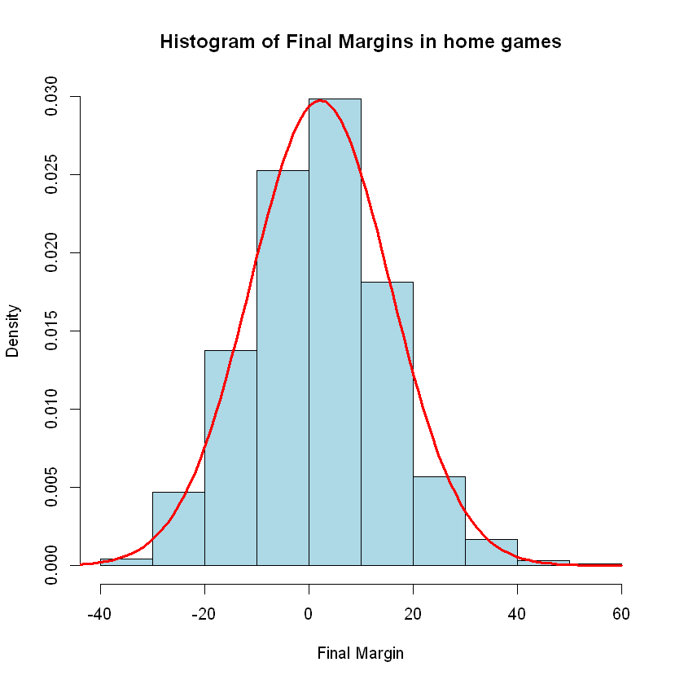
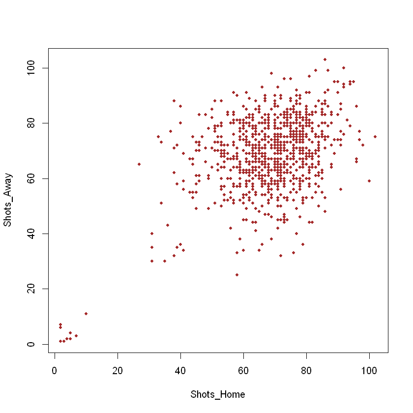

```python
NBA <- read.csv('/Data/NBA_Shots_Clean.csv', header=TRUE)
Player_Info <- read.csv('/Data/Player_Info.csv', header=TRUE)
Player_Salary <- read.csv('/Data/Player_Salary.csv', header=TRUE)
print(names(NBA))

print("")

print("")
```

     [1] "GAME_ID"             "DATE"                "HOME_TEAM"          
     [4] "AWAY_TEAM"           "PLAYER_NAME"         "PLAYER_ID"          
     [7] "LOCATION"            "WIN_LOSE"            "FINAL_MARGIN"       
    [10] "SHOT_NUMBER"         "PERIOD"              "SEC_REMAIN"         
    [13] "SHOT_CLOCK"          "DRIBBLES"            "TOUCH_TIME"         
    [16] "SHOT_DIST"           "PTS_TYPE"            "CLOSEST_DEFENDER"   
    [19] "CLOSEST_DEFENDER_ID" "CLOSE_DEF_DIST"      "SUCCESS"            
    [1] ""
    [1] ""
    

In the section below, we will look at the final margins for games played at home and games played away, and try to see whether a statistical advantage exists for teams playing at home.
Firstly, we will work out the skewness for our dataset. Then, we will attempt to fit a distribution to the home and away data
Because our home and away data are mirrors of each other (That is, our home data and away data are the reverse of each other as for every home win there is an away defeat with the same final margin), we can analyze only the home data and then use this to make conclusions about both the home and away data. Thus, we will work out the skewness of just the home data, as the away data will simply have the negative of this value


```python
Margins_Home <- (NBA$FINAL_MARGIN[NBA$LOCATION == 'H'])
Remove_At <- c()
for (x in 1:length(Margins_Home)){
    if (x == 1){
        x <- 1
    }
    else if (Margins_Home[x] == Margins_Home[x-1]){
        Remove_At <- append(Remove_At, x)
    }
    else {
    
    }
}
Margins_Home <- Margins_Home[-Remove_At]
```


```python
Running_Total <- 0
X_Bar <- mean(Margins_Home)
for (x in Margins_Home){
    Running_Total <- Running_Total + (x - X_Bar)^3
}
Running_Total <- Running_Total / (length(Margins_Home)*sd(Margins_Home)^3)

Running_Total
```


0.129932317533657


This skewness is less than 0.5, and thus the data is not considered to be significantly skewed (This is a standard figure for analysing skewness coeficients).A normal distribution has 0 skewness, and as we do not have a significant skewness here, we can take this as evidence that it is appropriate to use the central limit theorem to attempt to fit a normal distribution to this data.

We will assume that the final margins are independent of each other. Thus, we can assume by the central limit theorem (and the law of large numbers) that the final margins of home games, called M here, follow
$X \sim {N}(\mu, \sigma^2)$
where $\mu$ is the mean and $\sigma$ is the standard deviation
Now we need to estimate the mean and standard deviation of the distribution. The maximum likelihood estimator for this is the standard deviation of the sample. Thus, we will calculate this and fit that distribution for the histogram


```python
hist(Margins_Home, xlab = 'Final Margin', main='Histogram of Final Margins in home games', freq=FALSE, col='light blue')
lines(-60:60,dnorm(-60:60, mean=mean(Margins_Home), sd = sd(Margins_Home)), lwd=3, col='Red')
```


    

    


And now, with this approximated normal distribution, we will now perform a hypothesis test to see if we have enough evidence to reject a 0 mean for the entire population. If we can show that the population mean is greater than 0, we will have shown that there is evidence to support a statistical advantage for home teams in the NBA, especially since while the skewness of the data is very small, it is positive, and thus we have a slight asymmetrical dataset in favour of more positive values.

We will have null hypothesis Ho: $\mu$ = 0 and H1: $\mu$ > 0 and use a significance level of 1%


```python
t.test(Margins_Home, mu=0, alternative = "greater", conf.level=0.99)
```


    
    	One Sample t-test
    
    data:  Margins_Home
    t = 4.7173, df = 893, p-value = 1.386e-06
    alternative hypothesis: true mean is greater than 0
    99 percent confidence interval:
     1.070783      Inf
    sample estimates:
    mean of x 
     2.116331 
    


We can see that the p-value of this test is extremely low, far below 0.01, and thus we can confidently reject our null hypothesis and claim that the population of final margins of all home games will have a mean greater than zero. Thus, we can say that there is most likely a statistical homeside advantage for NBA teams.

Now let us explore some reasons that this may be the case. We are going to look into the number of shots taken each game by home and away teams. This will allow us to find some context on why home teams may be performing better than away teams. My hypothesis is that home teams are winning due to increased confidence, given to them by familiar surroundings, a shorter travel time, and home fans. This would be shown through an increase in aggressive play by home sides in the NBA, which the shots taken statistic will give us. First, let us find the basic statistics of this data


```python
Shots_Home <- c()
Shots_Away <- c()

Unique_Games <- unique(NBA$GAME_ID)

for (X in Unique_Games){
    Shots_Home <- append(Shots_Home, nrow(subset(NBA, GAME_ID == X & LOCATION == 'H')))
    Shots_Away <- append(Shots_Away, nrow(subset(NBA, GAME_ID == X & LOCATION == 'A')))
}

par(mfrow = c(1, 2)) 
hist(Shots_Home, freq=FALSE)
hist(Shots_Away, freq=FALSE)

my_table <- setNames(Shots_Home, Shots_Away)
my_table <- as.table(my_table)
#my_table
sum(Shots_Home)
sum(Shots_Away)
```


62089


62275


    

    


We can see that these distributions of the data are extremely similar. Thus, let us see if they are, in fact, corrolated.


```python
plot(Shots_Home, Shots_Away, pch=20, col='brown')
```


    

    


```python
cor.test(Shots_Home, Shots_Away)
```


    
    	Pearson's product-moment correlation
    
    data:  Shots_Home and Shots_Away
    t = 15.2, df = 902, p-value < 2.2e-16
    alternative hypothesis: true correlation is not equal to 0
    95 percent confidence interval:
     0.3980876 0.5019923
    sample estimates:
          cor 
    0.4515696 
    


We see by the Pearson Correlation Coefficient of 0.45 that there is a positive correlation between shots by the home team and shots by the away team. This implies that the home team having a large amount of shots does not mean that they are going to be dominating the game, as the away team is likely also making a large number of shots. The coefficient is not large however, as games will not always be close in either team's favour. Thus, we will perform a hypothesis test to see whether it is likely that both populations have the same mean. If this is true, then we can assume that home teams must instead be more successful in the shots that they take.

By the central limit theorem once more, we will assume that the data is approximately normally distributed, as the number of shots taken per game is assumed to be independent. We will check that the variences of each sample are approximately equivilent in order to use a t-test


```python
sd(Shots_Home)
sd(Shots_Away)

t.test(Shots_Home, Shots_Away, var.equal=TRUE, conf.level = 0.99)
```


13.5262299567678


13.8941464011653


    
    	Two Sample t-test
    
    data:  Shots_Home and Shots_Away
    t = -0.31903, df = 1806, p-value = 0.7497
    alternative hypothesis: true difference in means is not equal to 0
    99 percent confidence interval:
     -1.868742  1.457238
    sample estimates:
    mean of x mean of y 
     68.68252  68.88827 
    


As we have a p-value of 0.7497, we have not got enough evidence from our dataset to suggest that the population means are different (in fact, it is most likely that they are, and so we can assume that the mean number of shots taken in home and away games are equal. Thus, we cannot say that the reason home teams have a statistical advantage is due to taking more shots. Thus, we must look into whether a home team's advantages are given by being more successful in the shots that they do take, or whether more high-point shots are being taken


```python
Shot_Types_Home <- (NBA$PTS_TYPE[NBA$LOCATION == 'H' & NBA$SUCCESS == 1])
Shot_Types_Away <- (NBA$PTS_TYPE[NBA$LOCATION == 'A' & NBA$SUCCESS == 1])
Plot <- barplot(c(length(Shot_Types_Home[Shot_Types_Home == 2]),length(Shot_Types_Home[Shot_Types_Home == 3]),
          length(Shot_Types_Away[Shot_Types_Away == 2]), length(Shot_Types_Away[Shot_Types_Away == 3])), 
          names.arg = c('Home 2 pointers', 'Home 3 pointers', 'Away 2 pointers', 'Away 3 pointers'), ylim = c(0, 30000))
Plot
text(x = Plot, y = c(24500, 7000, 24500, 7000), labels = c(length(Shot_Types_Home[Shot_Types_Home == 2]),length(Shot_Types_Home[Shot_Types_Home == 3]),
          length(Shot_Types_Away[Shot_Types_Away == 2]), length(Shot_Types_Away[Shot_Types_Away == 3])))

             
```


<table>
<tbody>
	<tr><td>0.7</td></tr>
	<tr><td>1.9</td></tr>
	<tr><td>3.1</td></tr>
	<tr><td>4.3</td></tr>
</tbody>
</table>


    

    


```python
Home_Perc <- length(Shot_Types_Home[Shot_Types_Home == 3])/(length(Shot_Types_Home[Shot_Types_Home == 2]) + length(Shot_Types_Home[Shot_Types_Home == 3])) * 100
sprintf('3 pointers account for %f percent of successful home shots', Home_Perc)

Away_Perc <- length(Shot_Types_Away[Shot_Types_Away == 3])/(length(Shot_Types_Away[Shot_Types_Away == 2]) + length(Shot_Types_Away[Shot_Types_Away == 3])) * 100
sprintf('3 pointers account for %f percent of successful Away shots', Away_Perc)
```


'3 pointers account for 20.604270 percent of successful home shots'


'3 pointers account for 19.813071 percent of successful Away shots'


There is approximately a 0.8% increase in the proportion of 3 pointers being taken by home teams. This is an increase, but so small of one that it most likely does not account for the entire home side advantage present in games. Let us look at the number of successful shots being taken by each team


```python
Shot_Suc_Home <- (nrow(subset(NBA, NBA$LOCATION == 'H' & NBA$SUCCESS == 1)))
Shot_Suc_Away <- (nrow(subset(NBA, NBA$LOCATION == 'A' & NBA$SUCCESS == 1)))
Suc_Shot_Home_PG <- c()
Suc_Shot_Away_PG <- c()

for (X in Unique_Games){
    Suc_Shot_Home_PG <- append(Suc_Shot_Home_PG, nrow(subset(NBA, GAME_ID == X & LOCATION == 'H' & NBA$SUCCESS == 1)))
    Suc_Shot_Away_PG <- append(Suc_Shot_Away_PG, nrow(subset(NBA, GAME_ID == X & LOCATION == 'A' & NBA$SUCCESS == 1)))
}


```


```python
par(mfrow = c(1,2))
Plot <- barplot(c(Shot_Suc_Home, Shot_Suc_Away), 
          names.arg = c('Home', 'Away'), ylim = c(0,31000), main = 'Total Successful Shots')
Plot
text(x = Plot, y = c(30000, 30000), labels = c(nrow(subset(NBA, NBA$LOCATION == 'H' & NBA$SUCCESS == 1)), nrow(subset(NBA, NBA$LOCATION == 'A' & NBA$SUCCESS == 1))))


Plot2 <- barplot(c(mean(Suc_Shot_Home_PG), mean(Suc_Shot_Away_PG)), 
          names.arg = c('Home', 'Away'), 
                         ylim = c(0,40), main = 'Mean Successful Shots per game')

text(x = Plot2, y = c(34, 34), labels = c(round(mean(Suc_Shot_Home_PG), digits = 4), round(mean(Suc_Shot_Away_PG), digits = 4)))

```


<table>
<tbody>
	<tr><td>0.7</td></tr>
	<tr><td>1.9</td></tr>
</tbody>
</table>


    

    


```python
t.test(Suc_Shot_Home_PG, Suc_Shot_Away_PG, var.equal=TRUE, conf.level = 0.95)
```


    
    	Two Sample t-test
    
    data:  Suc_Shot_Home_PG and Suc_Shot_Away_PG
    t = 1.287, df = 1806, p-value = 0.1983
    alternative hypothesis: true difference in means is not equal to 0
    95 percent confidence interval:
     -0.2312396  1.1139830
    sample estimates:
    mean of x mean of y 
     31.45022  31.00885 
    


From the data here, we can see a very slight increase in successful shots from the home team per game, as well as a slight increase in the number of 3 point shots taken by the home team. This could account for the home advantage, however it would imply that the home advantage is in itself a very small factor. As the number of shots taken is not the cause of the home advantage, and the value and frequency of successful shots seems to be a small factor, we must consider how impactful the home advantage actually is to the game.

Now, let us look to see how individual players are affected by the home advantage. One possibility is that while on the whole our home advantage is small, there are individual players who respond so well to the comfort of playing at home that they are massively more successful when playing at home, and such they are the cause of our home advantage


```python
Unique_Players <- unique(NBA$PLAYER_NAME)
Player_Suc_Shots_Prop <- c()
for (Name in Unique_Players){
    Player_Suc_Shots_Prop <- append(Player_Suc_Shots_Prop, 
                                    nrow(subset(NBA, LOCATION == 'H' & SUCCESS == 1 & PLAYER_NAME == Name))/nrow(subset(NBA, LOCATION == 'A' & SUCCESS == 1 & PLAYER_NAME == Name)))
}
```


```python
Unique_Players[which.max(Player_Suc_Shots_Prop)]
Player_Suc_Shots_Prop[which.max(Player_Suc_Shots_Prop)]
nrow(subset(NBA, SUCCESS == 1 & PLAYER_NAME == Unique_Players[which.max(Player_Suc_Shots_Prop)]))

Unique_Players[which.min(Player_Suc_Shots_Prop)]
Player_Suc_Shots_Prop[which.min(Player_Suc_Shots_Prop)]
nrow(subset(NBA, SUCCESS == 1 & PLAYER_NAME == Unique_Players[which.min(Player_Suc_Shots_Prop)]))

```


Derrick Williams
<details>
	<summary style=display:list-item;cursor:pointer>
		<strong>Levels</strong>:
	</summary>
	<ol class=list-inline>
		<li>'Aaron Brooks'</li>
		<li>'Aaron Gordon'</li>
		<li>'Al Farouq Aminu'</li>
		<li>'Al Horford'</li>
		<li>'Al Jefferson'</li>
		<li>'Alan Anderson'</li>
		<li>'Alex Len'</li>
		<li>'Alexis Ajinca'</li>
		<li>'Allen Crabbe'</li>
		<li>'Alonzo Gee'</li>
		<li>'Amare Stoudemire'</li>
		<li>'Amir Johnson'</li>
		<li>'Andre Drummond'</li>
		<li>'Andre Iguodala'</li>
		<li>'Andre Miller'</li>
		<li>'Andre Roberson'</li>
		<li>'Andrew Bogut'</li>
		<li>'Andrew Wiggins'</li>
		<li>'Anthony Bennett'</li>
		<li>'Anthony Davis'</li>
		<li>'Anthony Morrow'</li>
		<li>'Aron Baynes'</li>
		<li>'Arron Afflalo'</li>
		<li>'Avery Bradley'</li>
		<li>'Ben Gordon'</li>
		<li>'Ben Mclemore'</li>
		<li>'Beno Udrih'</li>
		<li>'Bismack Biyombo'</li>
		<li>'Blake Griffin'</li>
		<li>'Bojan Bogdanovic'</li>
		<li>'Boris Diaw'</li>
		<li>'Bradley Beal'</li>
		<li>'Brandon Bass'</li>
		<li>'Brandon Jennings'</li>
		<li>'Brandon Knight'</li>
		<li>'Brian Roberts'</li>
		<li>'Brook Lopez'</li>
		<li>'Carl Landry'</li>
		<li>'Carlos Boozer'</li>
		<li>'Carmelo Anthony'</li>
		<li>'Caron Butler'</li>
		<li>'Chandler Parsons'</li>
		<li>'Channing Frye'</li>
		<li>'Charlie Villanueva'</li>
		<li>'Chase Budinger'</li>
		<li>'Chris Andersen'</li>
		<li>'Chris Bosh'</li>
		<li>'Chris Copeland'</li>
		<li>'Chris Kaman'</li>
		<li>'Chris Paul'</li>
		<li>'Cj Mccollum'</li>
		<li>'Cj Miles'</li>
		<li>'Cj Watson'</li>
		<li>'Cody Zeller'</li>
		<li>'Cole Aldrich'</li>
		<li>'Cory Joseph'</li>
		<li>'Courtney Lee'</li>
		<li>'Damian Lillard'</li>
		<li>'Damjan Rudez'</li>
		<li>'Danilo Gallinari'</li>
		<li>'Danny Green'</li>
		<li>'Dante Cunningham'</li>
		<li>'Dante Exum'</li>
		<li>'Darrell Arthur'</li>
		<li>'Darren Collison'</li>
		<li>'David West'</li>
		<li>'Deandre Jordan'</li>
		<li>'Demarcus Cousins'</li>
		<li>'Demarre Carroll'</li>
		<li>'Dennis Schroder'</li>
		<li>'Deron Williams'</li>
		<li>'Derrick Favors'</li>
		<li>'Derrick Rose'</li>
		<li>'Derrick Williams'</li>
		<li>'Devin Harris'</li>
		<li>'Dirk Nowitzki'</li>
		<li>'Dj Augustin'</li>
		<li>'Donald Sloan'</li>
		<li>'Donatas Motiejunas'</li>
		<li>'Draymond Green'</li>
		<li>'Dwight Howard'</li>
		<li>'Dwyane Wade'</li>
		<li>'Ed Davis'</li>
		<li>'Elfrid Payton'</li>
		<li>'Enes Kanter'</li>
		<li>'Eric Bledsoe'</li>
		<li>'Evan Fournier'</li>
		<li>'Evan Turner'</li>
		<li>'Garrett Temple'</li>
		<li>'Gary Neal'</li>
		<li>'Gerald Green'</li>
		<li>'Gerald Henderson'</li>
		<li>'Giannis Antetokounmpo'</li>
		<li>'Glen Davis'</li>
		<li>'Goran Dragic'</li>
		<li>'Gordon Hayward'</li>
		<li>'Gorgui Dieng'</li>
		<li>'Greg Monroe'</li>
		<li>'Greg Smith'</li>
		<li>'Greivis Vasquez'</li>
		<li>'Harrison Barnes'</li>
		<li>'Hedo Turkoglu'</li>
		<li>'Henry Sims'</li>
		<li>'Hollis Thompson'</li>
		<li>'Isaiah Thomas'</li>
		<li>'Jakarr Sampson'</li>
		<li>'Jamal Crawford'</li>
		<li>'James Ennis'</li>
		<li>'James Harden'</li>
		<li>'James Johnson'</li>
		<li>'Jared Dudley'</li>
		<li>'Jared Sullinger'</li>
		<li>'Jarrett Jack'</li>
		<li>'Jason Maxiell'</li>
		<li>'Jason Smith'</li>
		<li>'Jason Terry'</li>
		<li>'Jason Thompson'</li>
		<li>'Jeff Green'</li>
		<li>'Jeff Teague'</li>
		<li>'Jerami Grant'</li>
		<li>'Jeremy Lamb'</li>
		<li>'Jeremy Lin'</li>
		<li>'Jerome Jordan'</li>
		<li>'Jerryd Bayless'</li>
		<li>'Jimmer Fredette'</li>
		<li>'Jimmy Butler'</li>
		<li>'Jj Hickson'</li>
		<li>'Jj Redick'</li>
		<li>'Joakim Noah'</li>
		<li>'Joe Harris'</li>
		<li>'Joe Ingles'</li>
		<li>'Joe Johnson'</li>
		<li>'Joey Dorsey'</li>
		<li>'John Henson'</li>
		<li>'John Wall'</li>
		<li>'Jon Leuer'</li>
		<li>'Jonas Jerebko'</li>
		<li>'Jonas Valanciunas'</li>
		<li>'Jordan Farmar'</li>
		<li>'Jordan Hill'</li>
		<li>'Jose Calderon'</li>
		<li>'Jose Juan Barea'</li>
		<li>'Jrue Holiday'</li>
		<li>'Jusuf Nurkic'</li>
		<li>'Kawhi Leonard'</li>
		<li>'Kelly Olynyk'</li>
		<li>'Kemba Walker'</li>
		<li>'Kendrick Perkins'</li>
		<li>'Kenneth Faried'</li>
		<li>'Kent Bazemore'</li>
		<li>'Kentavious Caldwell-Pope'</li>
		<li>'Kevin Garnett'</li>
		<li>'Kevin Love'</li>
		<li>'Kevin Seraphin'</li>
		<li>'Khris Middleton'</li>
		<li>'Kirk Hinrich'</li>
		<li>'Kj Mcdaniels'</li>
		<li>'Klay Thompson'</li>
		<li>'Kobe Bryant'</li>
		<li>'Kosta Koufos'</li>
		<li>'Kostas Papanikolaou'</li>
		<li>'Kris Humphries'</li>
		<li>'Kyle Korver'</li>
		<li>'Kyle Lowry'</li>
		<li>'Kyle Oquinn'</li>
		<li>'Kyle Singler'</li>
		<li>'Kyrie Irving'</li>
		<li>'Lamarcus Aldridge'</li>
		<li>'Lance Stephenson'</li>
		<li>'Lavoy Allen'</li>
		<li>'Leandro Barbosa'</li>
		<li>'Lebron James'</li>
		<li>'Lou Williams'</li>
		<li>'Luc Mbah a Moute'</li>
		<li>'Luis Scola'</li>
		<li>'Luke Babbitt'</li>
		<li>'Luol Deng'</li>
		<li>'Manu Ginobili'</li>
		<li>'Marc Gasol'</li>
		<li>'Marcin Gortat'</li>
		<li>'Marco Belinelli'</li>
		<li>'Marcus Morris'</li>
		<li>'Marcus Smart'</li>
		<li>'Marcus Thornton'</li>
		<li>'Mario Chalmers'</li>
		<li>'Markieff Morris'</li>
		<li>'Marreese Speights'</li>
		<li>'Marvin Williams'</li>
		<li>'Mason Plumlee'</li>
		<li>'Matt Barnes'</li>
		<li>'Matt Bonner'</li>
		<li>'Matthew Dellavedova'</li>
		<li>'Michael Carter-Williams'</li>
		<li>'Michael Kidd-Gilchrist'</li>
		<li>'Mike Conley'</li>
		<li>'Mike Miller'</li>
		<li>'Mike Scott'</li>
		<li>'Mirza Teletovic'</li>
		<li>'Mo Williams'</li>
		<li>'Monta Ellis'</li>
		<li>'Nate Robinson'</li>
		<li>'Nene Hilario'</li>
		<li>'Nerlens Noel'</li>
		<li>'Nick Collison'</li>
		<li>'Nick Young'</li>
		<li>'Nicolas Batum'</li>
		<li>'Nik Stauskas'</li>
		<li>'Nikola Mirotic'</li>
		<li>'Nikola Vucevic'</li>
		<li>'Norris Cole'</li>
		<li>'Oj Mayo'</li>
		<li>'Omer Asik'</li>
		<li>'Omri Casspi'</li>
		<li>'Otto Porter'</li>
		<li>'Pablo Prigioni'</li>
		<li>'Patrick Beverley'</li>
		<li>'Patrick Patterson'</li>
		<li>'Pau Gasol'</li>
		<li>'Paul Millsap'</li>
		<li>'Paul Pierce'</li>
		<li>'Pero Antic'</li>
		<li>'Pj Tucker'</li>
		<li>'Quincy Acy'</li>
		<li>'Ramon Sessions'</li>
		<li>'Rasual Butler'</li>
		<li>'Ray Mccallum'</li>
		<li>'Reggie Jackson'</li>
		<li>'Richard Jefferson'</li>
		<li>'Robbie Hummel'</li>
		<li>'Robert Covington'</li>
		<li>'Robert Sacre'</li>
		<li>'Rodney Stuckey'</li>
		<li>'Ronnie Price'</li>
		<li>'Roy Hibbert'</li>
		<li>'Rudy Gay'</li>
		<li>'Rudy Gobert'</li>
		<li>'Russell Westbrook'</li>
		<li>'Ryan Anderson'</li>
		<li>'Serge Ibaka'</li>
		<li>'Shabazz Muhammad'</li>
		<li>'Shabazz Napier'</li>
		<li>'Shane Larkin'</li>
		<li>'Shaun Livingston'</li>
		<li>'Shawn Marion'</li>
		<li>'Shawne Williams'</li>
		<li>'Solomon Hill'</li>
		<li>'Spencer Hawes'</li>
		<li>'Stephen Curry'</li>
		<li>'Steve Adams'</li>
		<li>'Steve Blake'</li>
		<li>'Taj Gibson'</li>
		<li>'Terrence Ross'</li>
		<li>'Thabo Sefolosha'</li>
		<li>'Thaddeus Young'</li>
		<li>'Tim Duncan'</li>
		<li>'Time Hardaway Jr'</li>
		<li>'Timofey Mozgov'</li>
		<li>'Tobias Harris'</li>
		<li>'Tony Allen'</li>
		<li>'Tony Parker'</li>
		<li>'Tony Snell'</li>
		<li>'Travis Wear'</li>
		<li>'Trevor Ariza'</li>
		<li>'Trevor Booker'</li>
		<li>'Trey Burke'</li>
		<li>'Tristan Thompson'</li>
		<li>'Ty Lawson'</li>
		<li>'Tyler Hansbrough'</li>
		<li>'Tyler Zeller'</li>
		<li>'Tyreke Evans'</li>
		<li>'Tyson Chandler'</li>
		<li>'Udonis Haslem'</li>
		<li>'Victor Oladipo'</li>
		<li>'Vince Carter'</li>
		<li>'Wayne Ellington'</li>
		<li>'Wesley Johnson'</li>
		<li>'Wesley Matthews'</li>
		<li>'Wilson Chandler'</li>
		<li>'Zach Lavine'</li>
		<li>'Zach Randolph'</li>
		<li>'Zaza Pachulia'</li>
	</ol>
</details>


1.97619047619048


125


Robbie Hummel
<details>
	<summary style=display:list-item;cursor:pointer>
		<strong>Levels</strong>:
	</summary>
	<ol class=list-inline>
		<li>'Aaron Brooks'</li>
		<li>'Aaron Gordon'</li>
		<li>'Al Farouq Aminu'</li>
		<li>'Al Horford'</li>
		<li>'Al Jefferson'</li>
		<li>'Alan Anderson'</li>
		<li>'Alex Len'</li>
		<li>'Alexis Ajinca'</li>
		<li>'Allen Crabbe'</li>
		<li>'Alonzo Gee'</li>
		<li>'Amare Stoudemire'</li>
		<li>'Amir Johnson'</li>
		<li>'Andre Drummond'</li>
		<li>'Andre Iguodala'</li>
		<li>'Andre Miller'</li>
		<li>'Andre Roberson'</li>
		<li>'Andrew Bogut'</li>
		<li>'Andrew Wiggins'</li>
		<li>'Anthony Bennett'</li>
		<li>'Anthony Davis'</li>
		<li>'Anthony Morrow'</li>
		<li>'Aron Baynes'</li>
		<li>'Arron Afflalo'</li>
		<li>'Avery Bradley'</li>
		<li>'Ben Gordon'</li>
		<li>'Ben Mclemore'</li>
		<li>'Beno Udrih'</li>
		<li>'Bismack Biyombo'</li>
		<li>'Blake Griffin'</li>
		<li>'Bojan Bogdanovic'</li>
		<li>'Boris Diaw'</li>
		<li>'Bradley Beal'</li>
		<li>'Brandon Bass'</li>
		<li>'Brandon Jennings'</li>
		<li>'Brandon Knight'</li>
		<li>'Brian Roberts'</li>
		<li>'Brook Lopez'</li>
		<li>'Carl Landry'</li>
		<li>'Carlos Boozer'</li>
		<li>'Carmelo Anthony'</li>
		<li>'Caron Butler'</li>
		<li>'Chandler Parsons'</li>
		<li>'Channing Frye'</li>
		<li>'Charlie Villanueva'</li>
		<li>'Chase Budinger'</li>
		<li>'Chris Andersen'</li>
		<li>'Chris Bosh'</li>
		<li>'Chris Copeland'</li>
		<li>'Chris Kaman'</li>
		<li>'Chris Paul'</li>
		<li>'Cj Mccollum'</li>
		<li>'Cj Miles'</li>
		<li>'Cj Watson'</li>
		<li>'Cody Zeller'</li>
		<li>'Cole Aldrich'</li>
		<li>'Cory Joseph'</li>
		<li>'Courtney Lee'</li>
		<li>'Damian Lillard'</li>
		<li>'Damjan Rudez'</li>
		<li>'Danilo Gallinari'</li>
		<li>'Danny Green'</li>
		<li>'Dante Cunningham'</li>
		<li>'Dante Exum'</li>
		<li>'Darrell Arthur'</li>
		<li>'Darren Collison'</li>
		<li>'David West'</li>
		<li>'Deandre Jordan'</li>
		<li>'Demarcus Cousins'</li>
		<li>'Demarre Carroll'</li>
		<li>'Dennis Schroder'</li>
		<li>'Deron Williams'</li>
		<li>'Derrick Favors'</li>
		<li>'Derrick Rose'</li>
		<li>'Derrick Williams'</li>
		<li>'Devin Harris'</li>
		<li>'Dirk Nowitzki'</li>
		<li>'Dj Augustin'</li>
		<li>'Donald Sloan'</li>
		<li>'Donatas Motiejunas'</li>
		<li>'Draymond Green'</li>
		<li>'Dwight Howard'</li>
		<li>'Dwyane Wade'</li>
		<li>'Ed Davis'</li>
		<li>'Elfrid Payton'</li>
		<li>'Enes Kanter'</li>
		<li>'Eric Bledsoe'</li>
		<li>'Evan Fournier'</li>
		<li>'Evan Turner'</li>
		<li>'Garrett Temple'</li>
		<li>'Gary Neal'</li>
		<li>'Gerald Green'</li>
		<li>'Gerald Henderson'</li>
		<li>'Giannis Antetokounmpo'</li>
		<li>'Glen Davis'</li>
		<li>'Goran Dragic'</li>
		<li>'Gordon Hayward'</li>
		<li>'Gorgui Dieng'</li>
		<li>'Greg Monroe'</li>
		<li>'Greg Smith'</li>
		<li>'Greivis Vasquez'</li>
		<li>'Harrison Barnes'</li>
		<li>'Hedo Turkoglu'</li>
		<li>'Henry Sims'</li>
		<li>'Hollis Thompson'</li>
		<li>'Isaiah Thomas'</li>
		<li>'Jakarr Sampson'</li>
		<li>'Jamal Crawford'</li>
		<li>'James Ennis'</li>
		<li>'James Harden'</li>
		<li>'James Johnson'</li>
		<li>'Jared Dudley'</li>
		<li>'Jared Sullinger'</li>
		<li>'Jarrett Jack'</li>
		<li>'Jason Maxiell'</li>
		<li>'Jason Smith'</li>
		<li>'Jason Terry'</li>
		<li>'Jason Thompson'</li>
		<li>'Jeff Green'</li>
		<li>'Jeff Teague'</li>
		<li>'Jerami Grant'</li>
		<li>'Jeremy Lamb'</li>
		<li>'Jeremy Lin'</li>
		<li>'Jerome Jordan'</li>
		<li>'Jerryd Bayless'</li>
		<li>'Jimmer Fredette'</li>
		<li>'Jimmy Butler'</li>
		<li>'Jj Hickson'</li>
		<li>'Jj Redick'</li>
		<li>'Joakim Noah'</li>
		<li>'Joe Harris'</li>
		<li>'Joe Ingles'</li>
		<li>'Joe Johnson'</li>
		<li>'Joey Dorsey'</li>
		<li>'John Henson'</li>
		<li>'John Wall'</li>
		<li>'Jon Leuer'</li>
		<li>'Jonas Jerebko'</li>
		<li>'Jonas Valanciunas'</li>
		<li>'Jordan Farmar'</li>
		<li>'Jordan Hill'</li>
		<li>'Jose Calderon'</li>
		<li>'Jose Juan Barea'</li>
		<li>'Jrue Holiday'</li>
		<li>'Jusuf Nurkic'</li>
		<li>'Kawhi Leonard'</li>
		<li>'Kelly Olynyk'</li>
		<li>'Kemba Walker'</li>
		<li>'Kendrick Perkins'</li>
		<li>'Kenneth Faried'</li>
		<li>'Kent Bazemore'</li>
		<li>'Kentavious Caldwell-Pope'</li>
		<li>'Kevin Garnett'</li>
		<li>'Kevin Love'</li>
		<li>'Kevin Seraphin'</li>
		<li>'Khris Middleton'</li>
		<li>'Kirk Hinrich'</li>
		<li>'Kj Mcdaniels'</li>
		<li>'Klay Thompson'</li>
		<li>'Kobe Bryant'</li>
		<li>'Kosta Koufos'</li>
		<li>'Kostas Papanikolaou'</li>
		<li>'Kris Humphries'</li>
		<li>'Kyle Korver'</li>
		<li>'Kyle Lowry'</li>
		<li>'Kyle Oquinn'</li>
		<li>'Kyle Singler'</li>
		<li>'Kyrie Irving'</li>
		<li>'Lamarcus Aldridge'</li>
		<li>'Lance Stephenson'</li>
		<li>'Lavoy Allen'</li>
		<li>'Leandro Barbosa'</li>
		<li>'Lebron James'</li>
		<li>'Lou Williams'</li>
		<li>'Luc Mbah a Moute'</li>
		<li>'Luis Scola'</li>
		<li>'Luke Babbitt'</li>
		<li>'Luol Deng'</li>
		<li>'Manu Ginobili'</li>
		<li>'Marc Gasol'</li>
		<li>'Marcin Gortat'</li>
		<li>'Marco Belinelli'</li>
		<li>'Marcus Morris'</li>
		<li>'Marcus Smart'</li>
		<li>'Marcus Thornton'</li>
		<li>'Mario Chalmers'</li>
		<li>'Markieff Morris'</li>
		<li>'Marreese Speights'</li>
		<li>'Marvin Williams'</li>
		<li>'Mason Plumlee'</li>
		<li>'Matt Barnes'</li>
		<li>'Matt Bonner'</li>
		<li>'Matthew Dellavedova'</li>
		<li>'Michael Carter-Williams'</li>
		<li>'Michael Kidd-Gilchrist'</li>
		<li>'Mike Conley'</li>
		<li>'Mike Miller'</li>
		<li>'Mike Scott'</li>
		<li>'Mirza Teletovic'</li>
		<li>'Mo Williams'</li>
		<li>'Monta Ellis'</li>
		<li>'Nate Robinson'</li>
		<li>'Nene Hilario'</li>
		<li>'Nerlens Noel'</li>
		<li>'Nick Collison'</li>
		<li>'Nick Young'</li>
		<li>'Nicolas Batum'</li>
		<li>'Nik Stauskas'</li>
		<li>'Nikola Mirotic'</li>
		<li>'Nikola Vucevic'</li>
		<li>'Norris Cole'</li>
		<li>'Oj Mayo'</li>
		<li>'Omer Asik'</li>
		<li>'Omri Casspi'</li>
		<li>'Otto Porter'</li>
		<li>'Pablo Prigioni'</li>
		<li>'Patrick Beverley'</li>
		<li>'Patrick Patterson'</li>
		<li>'Pau Gasol'</li>
		<li>'Paul Millsap'</li>
		<li>'Paul Pierce'</li>
		<li>'Pero Antic'</li>
		<li>'Pj Tucker'</li>
		<li>'Quincy Acy'</li>
		<li>'Ramon Sessions'</li>
		<li>'Rasual Butler'</li>
		<li>'Ray Mccallum'</li>
		<li>'Reggie Jackson'</li>
		<li>'Richard Jefferson'</li>
		<li>'Robbie Hummel'</li>
		<li>'Robert Covington'</li>
		<li>'Robert Sacre'</li>
		<li>'Rodney Stuckey'</li>
		<li>'Ronnie Price'</li>
		<li>'Roy Hibbert'</li>
		<li>'Rudy Gay'</li>
		<li>'Rudy Gobert'</li>
		<li>'Russell Westbrook'</li>
		<li>'Ryan Anderson'</li>
		<li>'Serge Ibaka'</li>
		<li>'Shabazz Muhammad'</li>
		<li>'Shabazz Napier'</li>
		<li>'Shane Larkin'</li>
		<li>'Shaun Livingston'</li>
		<li>'Shawn Marion'</li>
		<li>'Shawne Williams'</li>
		<li>'Solomon Hill'</li>
		<li>'Spencer Hawes'</li>
		<li>'Stephen Curry'</li>
		<li>'Steve Adams'</li>
		<li>'Steve Blake'</li>
		<li>'Taj Gibson'</li>
		<li>'Terrence Ross'</li>
		<li>'Thabo Sefolosha'</li>
		<li>'Thaddeus Young'</li>
		<li>'Tim Duncan'</li>
		<li>'Time Hardaway Jr'</li>
		<li>'Timofey Mozgov'</li>
		<li>'Tobias Harris'</li>
		<li>'Tony Allen'</li>
		<li>'Tony Parker'</li>
		<li>'Tony Snell'</li>
		<li>'Travis Wear'</li>
		<li>'Trevor Ariza'</li>
		<li>'Trevor Booker'</li>
		<li>'Trey Burke'</li>
		<li>'Tristan Thompson'</li>
		<li>'Ty Lawson'</li>
		<li>'Tyler Hansbrough'</li>
		<li>'Tyler Zeller'</li>
		<li>'Tyreke Evans'</li>
		<li>'Tyson Chandler'</li>
		<li>'Udonis Haslem'</li>
		<li>'Victor Oladipo'</li>
		<li>'Vince Carter'</li>
		<li>'Wayne Ellington'</li>
		<li>'Wesley Johnson'</li>
		<li>'Wesley Matthews'</li>
		<li>'Wilson Chandler'</li>
		<li>'Zach Lavine'</li>
		<li>'Zach Randolph'</li>
		<li>'Zaza Pachulia'</li>
	</ol>
</details>


0.473684210526316


56


Here we see that the player Derrick Williams has nearly twice as many successful shots when playing at home than when playing away! Thats about 66% of his successful shots taken when at home!
On the other hand, Robbie Hummel has scored almost 66% of his successful shots when away! Now let us look at the distribution of this


```python
hist(Player_Suc_Shots_Prop, freq=FALSE, main = 'Proportion of successful shots at home vs away per player', 
     col='Light Blue', xlab='Proportion')
print("calculated by number of successful shots at home divided by the number of successful shots away")
```

    [1] "calculated by number of successful shots at home divided by the number of successful shots away"
    


    

    


This histogram shows us something interesting. Most player's tend to hover around scoring an equal amount of shots when home and away. However, the players who are affected by this the most actually score much more when at home, which is most likely where our differential is coming from. The players who are performing better in away games seem to be marginally more successful away. Let us see this data again, but for the following statistics:
1) Proportion of shots which are successful at home

2) Proportion of successful 3 pointers scored at home vs away


```python
Player_Suc_Shots_Home <- c()
Player_Suc_TP <- c()
Player_Suc_Shots_Away <- c()
for (Name in Unique_Players){
    Player_Suc_Shots_Home <- append(Player_Suc_Shots_Home, 
                                    nrow(subset(NBA, LOCATION == 'H' & SUCCESS == 1 & PLAYER_NAME == Name))/nrow(subset(NBA, PLAYER_NAME == Name)))
    Player_Suc_Shots_Away <- append(Player_Suc_Shots_Away, 
                                    nrow(subset(NBA, LOCATION == 'A' & SUCCESS == 1 & PLAYER_NAME == Name))/nrow(subset(NBA, PLAYER_NAME == Name)))
    Player_Suc_TP <- append(Player_Suc_TP, 
                                    nrow(subset(NBA, LOCATION == 'H' & SUCCESS == 1 & PLAYER_NAME == Name & PTS_TYPE == 3))/nrow(subset(NBA, SUCCESS == 1 & PLAYER_NAME == Name & PTS_TYPE == 3)))

}
```


```python
sprintf("On average players score %f percent of their shots at home", mean(Player_Suc_Shots_Home)*100)
sprintf("On average players score %f percent of their shots at away", mean(Player_Suc_Shots_Away)*100)
hist(Player_Suc_Shots_Home, freq=FALSE, main = 'Proportion of shots at home which are successful per player', 
     col='Light Blue', xlab='Proportion', xlim=c(0.1,0.4))
abline(v=mean(Player_Suc_Shots_Home), lwd=5)

hist(Player_Suc_Shots_Away, freq=FALSE, main = 'Proportion of shots at home which are successful per player', 
     col='Light Blue', xlab='Proportion', xlim=c(0.1,0.4))
abline(v=mean(Player_Suc_Shots_Away), lwd=5)

```


'On average players score 22.730648 percent of their shots at home'


'On average players score 22.617695 percent of their shots at away'


    

    


    

    


```python
#par(mfrow = c(1,2))
hist(Player_Suc_TP, main = 'proportion home/away < 1', 
     col='Light Blue', xlab='Proportion', freq=FALSE)
abline(v=mean(Player_Suc_TP[is.nan(Player_Suc_TP) == FALSE]), lwd = 5)
#hist(Player_Suc_TP[Player_Suc_TP > 1], main = 'proportion home/away > 1', 
  #   col='Light Blue', xlab='Proportion')
sprintf('The total number of players with a higher number of 3 pointers at home than away is %d', length(Player_Suc_TP[Player_Suc_TP > 0.5 & is.nan(Player_Suc_TP) == FALSE]))
sprintf('The total number of players with a higher number of 3 pointers away than at home is %d', length(Player_Suc_TP[Player_Suc_TP < 0.5 & is.nan(Player_Suc_TP) == FALSE]))
sprintf('The total number of players with the same number of 3 pointers away and at home is %d', length(Player_Suc_TP[Player_Suc_TP == 0.5 & is.nan(Player_Suc_TP) == FALSE]))
sprintf('The mean proportion of 3 pointers at home vs away is %f', mean(Player_Suc_TP[is.nan(Player_Suc_TP) == FALSE]))
sprintf('The mean proportion of 3 pointers at home vs away for players who score more at home is %f', mean(Player_Suc_TP[Player_Suc_TP > 0.5 & is.nan(Player_Suc_TP) == FALSE]))
sprintf('The mean proportion of 3 pointers at home vs away for players who score more away is %f', mean(Player_Suc_TP[Player_Suc_TP < 0.5 & is.nan(Player_Suc_TP) == FALSE]))
```


'The total number of players with a higher number of 3 pointers at home than away is 115'


'The total number of players with a higher number of 3 pointers away than at home is 99'


'The total number of players with the same number of 3 pointers away and at home is 22'


'The mean proportion of 3 pointers at home vs away is 0.493066'


'The mean proportion of 3 pointers at home vs away for players who score more at home is 0.602721'


'The mean proportion of 3 pointers at home vs away for players who score more away is 0.364148'


    

    


The data above shows that clearly players who score more while away, while less common, are actually more weighted to scoring much more while away. Let us check if the players who score more three pointers at home are players who are more experienced. If this is true, then the players who participate in more games are the players who are positively affected by playing at home, and thus would imply that our home advantage is given by an advantage in the players who contribute to the most games.
Note that in the below code, as we run through the data in the same order as in previous vectors, the corresponding indexed values (i.e entry n in Games_Per_Player and Player_Suc_TP) correspond to a value from the same player.


```python
Games_Per_Player <- c()
for (Name in Unique_Players){
    Games_Per_Player <- append(Games_Per_Player,(nrow(subset(NBA, PLAYER_NAME == Name))))
}

for (x in 1:length(Games_Per_Player)){
    if (is.nan(Player_Suc_TP[x])){
        Games_Per_Player <- Games_Per_Player[-x]
        Player_Suc_TP <- Player_Suc_TP[-x]
    }
}
```


```python
plot(Games_Per_Player, Player_Suc_TP,  pch=20, col='brown')
abline(lm(Player_Suc_TP ~ Games_Per_Player), lwd=4, lty=4)
```


    

    


We can see a positive gradient in our line, and so we can say that more experienced players tend to scoring more 3 pointers at home


```python

```


```python

```
